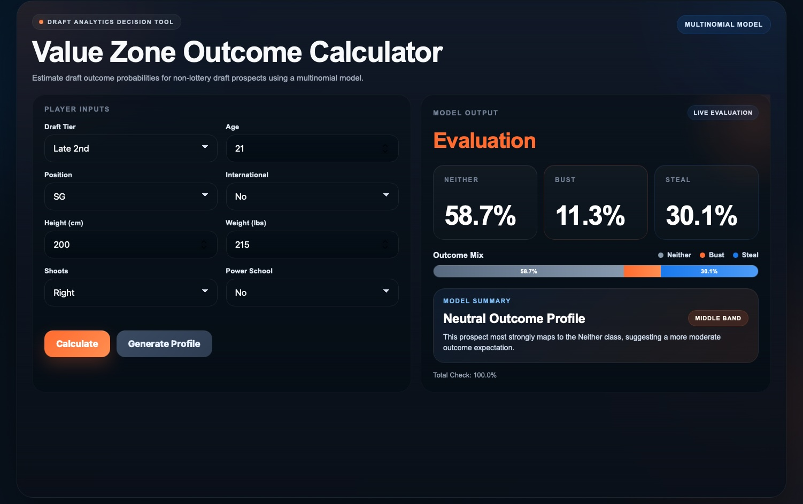

# NBA Draft Risk Calculator

NBA teams invest millions of dollars evaluating draft prospects, yet player outcomes remain highly uncertain. This project analyzes over 1,800 NBA draft selections from 1990–2020 to identify where draft value is concentrated and estimate the probability that a prospect becomes a **Bust**, **Steal**, or **Neither** based on historical pre-draft characteristics. The resulting model was deployed as an interactive web application called the **Value Zone Outcome Calculator**.

## Value Zone Outcome Calculator



## Try the Calculator!

Download or clone this repository and open `index.html` in your web browser to interact with the NBA Draft Risk Calculator.

## Key Features

- Analyzes more than 1,800 NBA draft selections from 1990–2020
- Groups players into draft tiers for fair historical comparisons
- Estimates the probability of a player becoming a **Bust**, **Steal**, or **Neither**
- Uses a multinomial logistic regression model trained on historical draft outcomes
- Provides an interactive web-based calculator for evaluating draft prospects

## Business Problem

NBA teams invest significant resources into scouting and player evaluation, but draft outcomes remain highly uncertain. While early draft picks often receive the most attention, identifying value outside the lottery can provide a significant competitive advantage.

This project explores whether historical draft data can be used to quantify draft risk and identify meaningful patterns that support better decision-making during the NBA Draft.

## Methodology

Historical NBA Draft data from 1990–2020 was collected, cleaned, and analyzed to compare player outcomes across five draft tiers:

- Top 3
- Lottery
- Non-Lottery First Round
- Early Second Round
- Late Second Round

Career Win Shares and NBA career length were used to evaluate player success relative to expectations within each tier. A multinomial logistic regression model was then developed to estimate the probability of three possible outcomes:

- Bust
- Steal
- Neither

## Model Inputs

The calculator estimates draft outcomes using historical pre-draft player characteristics, including:

- Draft Tier
- Position
- Age
- Height (cm)
- Weight (lbs)
- Shooting Hand
- International Status
- Power Conference Indicator

## Key Findings

- Draft value declines after the lottery, but meaningful upside still exists outside the top selections.
- Early second-round picks demonstrated stronger upside than late second-round picks.
- **Shooting guards selected in the early second round showed the highest historical probability of becoming steals among second-round positions.**
- Modeling draft outcomes as **Bust**, **Steal**, or **Neither** provided a more balanced framework for evaluating player risk than traditional binary classifications.

## Technologies Used

- Python
- Pandas
- NumPy
- Statsmodels
- HTML
- Multinomial Logistic Regression

## Repository Structure

```text
.
├── README.md
├── index.html
├── presentation/
│   └── NBA_Draft_Risk_Calculator_Presentation.pdf
└── screenshots/
    └── nba-draft-calculator-interface.jpg
```

## Project Background

This project was completed as the capstone for my Master of Science in Business Analytics at the University of Cincinnati. The goal was to combine predictive modeling with an interactive decision-support tool that demonstrates how historical data can support NBA draft evaluation.

## Future Improvements

- Expand the model using additional pre-draft performance metrics.
- Compare multinomial logistic regression against tree-based machine learning models.
- Deploy the calculator as a hosted web application.
- Continue refining the user interface and visualization of model outputs.
